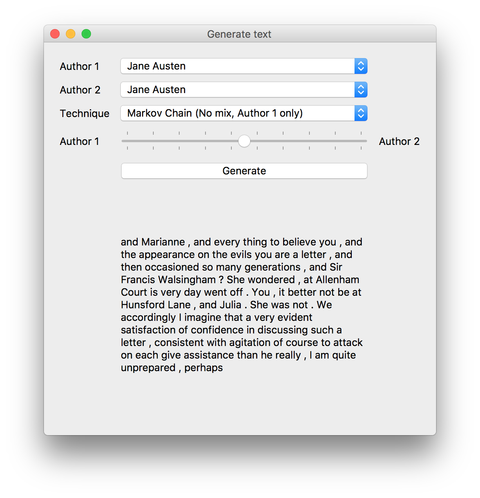

# Generate Text - Experimenting with different styles

> A random text generation GUI

Final project for LIN 353C (Intro to Computational Linguistics)

* (Site)[https://vivianistan.github.io/generate-text/#/]
* (Code)[https://github.com/vivianistan/generate-text]

 

    

      

        
      

    

  
  

# Background
This application can generate random text in the style of 5 different authors using some of their works from [Project Gutenberg](http://www.gutenberg.org): 
* Jane Austen
* G.K. Chesterton
* William Shakespeare
* Sir Arthur Conan Doyle
* Fyodor Dostoyevsky

It generates text using Maximum Likelihood Estimation (MLE) with bigrams and Markov Chains

The GUI was made using PyQT5 in Python3

## Approaches
### Maximum Likelihood Estimation
### Bigrams
### Markov Chains
### Evaluation Metrics

## Results

# Getting Started
## Running the application
